<div align="center">

# Inadimplência de Crédito no Brasil

### MVP — Pipeline de Dados em arquitetura medalhão no Databricks

[](https://www.databricks.com/)
[](https://delta.io/)
[](docs/catalogo_dados.md)
[](scripts/)
[](https://dadosabertos.bcb.gov.br/)
[](https://opendatacommons.org/licenses/odbl/)

[Visão geral](#visão-geral) · [Contexto](#contexto-de-negócios-e-perguntas-etapa-2-e-41) · [Carga](#carga-dos-dados-etapa-42) · [Modelagem](#modelagem-e-catálogo-de-dados-etapa-43) · [Pipeline](#pipeline-de-dados-etapa-44) · [Qualidade](#qualidade-de-dados-etapa-45) · [Análise](#análise-de-dados-etapa-45) · [Autoavaliação](#autoavaliação)

</div>

---

## Visão geral

<table>
<tr>
<td align="center"><b>6</b><br/>séries do BCB</td>
<td align="center"><b>1110</b><br/>registros na Silver</td>
<td align="center"><b>185</b><br/>meses (mar/2011 – jul/2026)</td>
<td align="center"><b>4</b><br/>tabelas Delta</td>
<td align="center"><b>0</b><br/>nulos e duplicatas</td>
</tr>
</table>

| Pergunta | Resposta em uma linha |
|---|---|
| **P1** Evolução da inadimplência total | Fechou jul/2026 em **4,88%**, o valor mais alto da série |
| **P2** PF vs. PJ | PF acima de PJ em **100% dos 185 meses** |
| **P3** Cartão vs. crédito rural (PF) | Rural saiu de 1,88% para **15,53%** e ultrapassou o cartão |
| **P4** Sazonalidade | Fraca: amplitude de apenas **0,29 p.p.** |
| **P5** Maior alta / queda mensal | **+0,30 p.p.** em jul/2026 · **-0,36 p.p.** em jun/2020 |

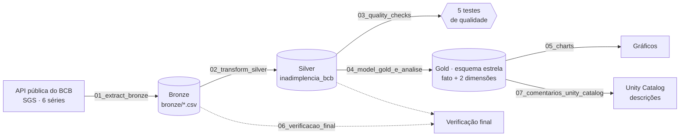

<details>
<summary><b>Estrutura do repositório</b></summary>

```text
.
├── bronze/                 # 6 CSVs brutos da API do BCB + _metadata_ingestao.json
├── scripts/                # notebooks 00–07, executados no Databricks
├── docs/
│   ├── catalogo_dados.md   # catálogo completo: tipos, domínios e linhagem
│   └── evidencias/         # prints de execução
├── charts/                 # gráficos gerados pelo 05_charts.py
└── README.md
```

</details>

---

## Contexto de Negócios e Perguntas (Etapa 2 e 4.1)

> **Problema:** entender como a inadimplência de crédito no Brasil evoluiu ao longo do tempo, comparando o comportamento entre pessoas físicas e jurídicas e entre diferentes modalidades de crédito.

**Perguntas de negócio:**

| # | Pergunta |
|---|---|
| P1 | Como a taxa de inadimplência total evoluiu nos últimos 15 anos? |
| P2 | Pessoas físicas têm taxa de inadimplência maior que pessoas jurídicas? |
| P3 | Como se comparam duas modalidades específicas — cartão de crédito (PF) e crédito rural (PF)? |
| P4 | Existe sazonalidade na inadimplência ao longo do ano? |
| P5 | Quais foram os períodos de maior alta/queda mensal registrados? |

**Fonte dos dados:** Banco Central do Brasil — Sistema Gerenciador de Séries Temporais (SGS), portal `dadosabertos.bcb.gov.br`. Seis séries temporais mensais, todas com o mesmo conceito (percentual da carteira de crédito com parcela em atraso superior a 90 dias), recortadas por segmento e modalidade.

Cada série bruta chega da API com apenas duas colunas: `data` (mês de referência, formato `dd/mm/aaaa`) e `valor` (percentual, com vírgula decimal). A estrutura é idêntica nas 6 séries — a diferença entre elas está só no recorte de segmento/modalidade, por isso o significado de cada uma precisou ser documentado à parte (ver [Catálogo de Dados](docs/catalogo_dados.md)):

| Código SGS | Segmento | Modalidade |
|:---:|---|---|
| `21082` | Total (SFN) | Todas |
| `21083` | Pessoa Jurídica | Todas |
| `21084` | Pessoa Física | Todas |
| `21129` | Pessoa Física | Cartão de crédito |
| `21104` | Pessoa Jurídica | Cartão de crédito rotativo |
| `21146` | Pessoa Física | Crédito rural |

> [!NOTE]
> **Licença:** Open Data Commons Open Database License (ODbL) — dados abertos, sem necessidade de autenticação, reutilização livre com atribuição à fonte.

---

## Carga dos Dados (Etapa 4.2)

Coleta feita via **API pública do BCB** (caso avançado — requisição HTTP, não apenas upload de arquivo estático), padrão:

```http
GET https://api.bcb.gov.br/dados/serie/bcdata.sgs.{codigo_serie}/dados?formato=csv
```

**Script:** [`scripts/01_extract_bronze.py`](scripts/01_extract_bronze.py) — documenta como os dados foram obtidos originalmente (chamada à API do BCB). Os 6 CSVs resultantes ficam versionados diretamente na pasta `bronze/` deste repositório e são lidos pelos notebooks a partir de um caminho relativo (`../bronze`), sem depender de Volume do Unity Catalog — mais simples para o escopo deste MVP.

<p align="center">
  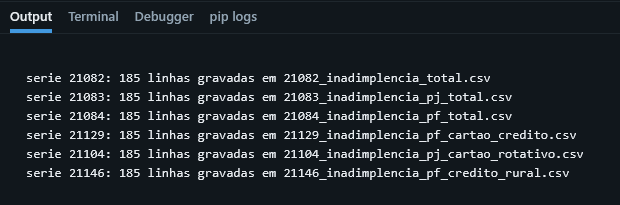
  <br/><sub>Saída do <code>01_extract_bronze.py</code> no Databricks: 6 séries coletadas da API, 185 linhas cada.</sub>
</p>

O hash (sha256) e a contagem de linhas de cada arquivo Bronze são calculados em `scripts/06_verificacao_final.py`; a validação dos registros está na seção de [Qualidade](#qualidade-de-dados-etapa-45).

---

## Modelagem e Catálogo de Dados (Etapa 4.3)

Arquitetura em camadas (medalhão): **Bronze → Silver → Gold**, com o Gold modelado em **esquema estrela**:

- `fato_inadimplencia` (grão: 1 série × 1 mês)
- `dim_tempo` (data, ano, mês, trimestre)
- `dim_segmento` (segmento, modalidade, descrição de negócio)

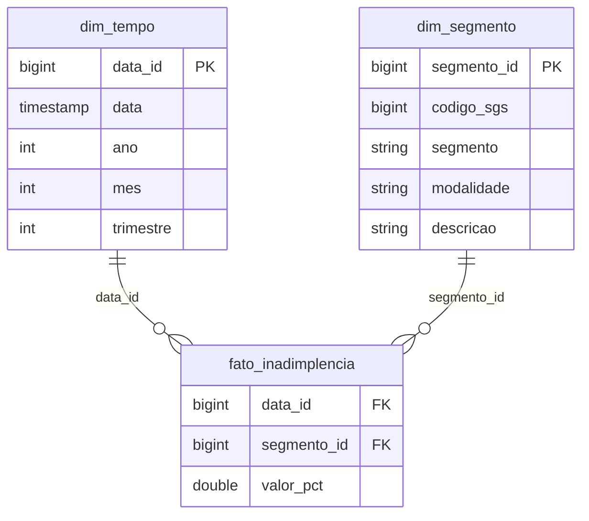

### Catálogo de dados

Transcrito de [`docs/catalogo_dados.md`](docs/catalogo_dados.md): todas as tabelas, campos, tipos, domínios e linhagem. As mesmas descrições foram gravadas no Unity Catalog pelo [`scripts/07_comentarios_unity_catalog.sql`](scripts/07_comentarios_unity_catalog.sql).

#### Camada Bronze

6 arquivos CSV, um por série temporal do SGS/BCB, dado exatamente como recebido da API (separador `;`, decimal `,`).

**Arquivos:** `bronze/<codigo_sgs>_inadimplencia_<recorte>.csv` (um arquivo por série)

| Campo | Tipo | Descrição | Domínio |
|---|---|---|---|
| `data` | string (`dd/mm/aaaa`) | Data de referência do mês, sempre dia 1 | `01/03/2011` a `01/07/2026` |
| `valor` | string (decimal com vírgula) | Percentual de inadimplência bruto, como veio da API | `"0,36"` a `"62,70"` |

**Linhagem:** extraído via API pública do BCB (`GET https://api.bcb.gov.br/dados/serie/bcdata.sgs.{codigo}/dados?formato=csv`), sem nenhuma transformação. Licença: Open Data Commons Open Database License (ODbL).


#### Camada Silver

**Tabela:** `silver.inadimplencia_bcb`

| Campo | Tipo | Descrição | Domínio |
|---|---|---|---|
| `data` | timestamp | Data de referência (mês), tipada a partir do bronze | 2011-03-01 a 2026-07-01 |
| `codigo_sgs` | bigint | Código da série no SGS/BCB, chave de origem | {21082, 21083, 21084, 21104, 21129, 21146} |
| `segmento` | string | Segmento do tomador de crédito | {total, pessoa_fisica, pessoa_juridica} |
| `modalidade` | string | Modalidade de crédito específica | {todas, cartao_credito, cartao_credito_rotativo, credito_rural} |
| `valor_pct` | double | Percentual de inadimplência, tipado (vírgula → ponto) | 0,36 a 62,70 |

**Linhagem:** concatenação dos 6 CSVs Bronze após parse de data, conversão de decimal e enriquecimento com `segmento`/`modalidade` a partir da lista de séries definida em `scripts/02_transform_silver.py`. Deduplicação por (`codigo_sgs`, `data`) aplicada (0 duplicatas encontradas).


#### Camada Gold — Esquema Estrela

**`fato_inadimplencia`** (grão: 1 linha = 1 série × 1 mês)

| Campo | Tipo | Descrição | Domínio |
|---|---|---|---|
| `data_id` | bigint | FK para `dim_tempo` (formato AAAAMM) | 201103 a 202607 |
| `segmento_id` | bigint | FK para `dim_segmento` (= `codigo_sgs`) | {21082, 21083, 21084, 21104, 21129, 21146} |
| `valor_pct` | double | Percentual de inadimplência do mês | 0,36 a 62,70 |

**`dim_tempo`**

| Campo | Tipo | Descrição | Domínio |
|---|---|---|---|
| `data_id` | bigint | Chave primária (AAAAMM) | 201103 a 202607 |
| `data` | timestamp | Primeiro dia do mês | 2011-03-01 a 2026-07-01 |
| `ano` | int | Ano de referência | 2011 a 2026 |
| `mes` | int | Mês de referência | 1 a 12 |
| `trimestre` | int | Trimestre do ano | 1 a 4 |

**`dim_segmento`**

| Campo | Tipo | Descrição | Domínio |
|---|---|---|---|
| `segmento_id` | bigint | Chave primária (= código SGS) | {21082, 21083, 21084, 21104, 21129, 21146} |
| `codigo_sgs` | bigint | Código oficial da série no BCB | idem |
| `segmento` | string | Tipo de tomador | {total, pessoa_fisica, pessoa_juridica} |
| `modalidade` | string | Modalidade de crédito | {todas, cartao_credito, cartao_credito_rotativo, credito_rural} |
| `descricao` | string | Descrição de negócio completa da série | texto livre |

**Linhagem:** `fato_inadimplencia` é uma projeção direta da tabela Silver; `dim_tempo` e `dim_segmento` são derivadas dos valores distintos da própria Silver, mantendo integridade referencial (validado: 0 chaves órfãs em ambas as dimensões).

**Catálogo no Unity Catalog** — descrições de tabelas e colunas preenchidas via [`scripts/07_comentarios_unity_catalog.sql`](scripts/07_comentarios_unity_catalog.sql):

<p align="center">
  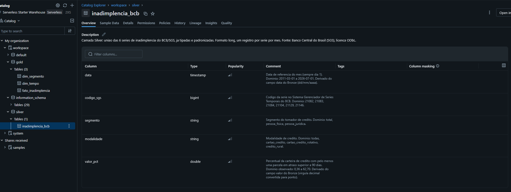
  <br/><sub><code>workspace.silver.inadimplencia_bcb</code></sub>
</p>

<p align="center">
  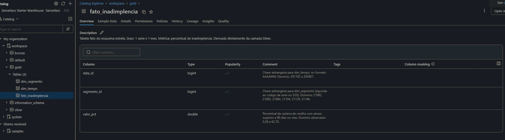
  <br/><sub><code>workspace.gold.fato_inadimplencia</code></sub>
</p>

<p align="center">
  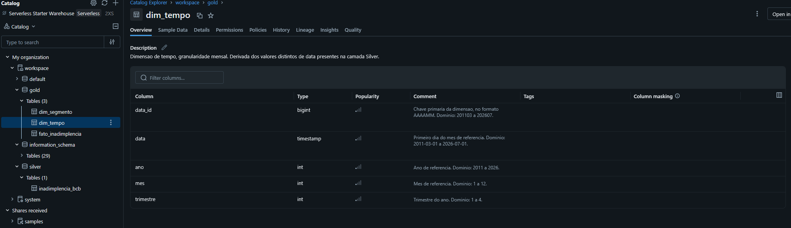
  <br/><sub><code>workspace.gold.dim_tempo</code></sub>
</p>

<p align="center">
  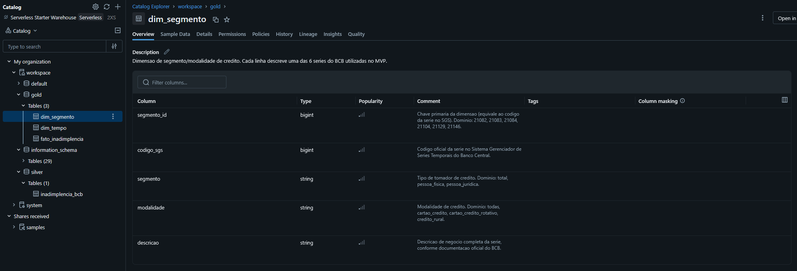
  <br/><sub><code>workspace.gold.dim_segmento</code></sub>
</p>

---

## Pipeline de Dados (Etapa 4.4)

Pipeline dividido em scripts, um por camada, para manter clareza e permitir reexecução independente (rodar como notebooks no Databricks, na ordem abaixo):

| Script | Camada | O que faz |
|---|:---:|---|
| [`00_setup.sql`](scripts/00_setup.sql) | — | Cria os schemas `workspace.silver` e `workspace.gold` (uma vez) |
| [`02_transform_silver.py`](scripts/02_transform_silver.py) | 🥈 Silver | Lê `../bronze`, tipa datas e valores, remove duplicatas, grava `workspace.silver.inadimplencia_bcb` |
| [`03_quality_checks.py`](scripts/03_quality_checks.py) | — | Roda os 5 testes de qualidade sobre a tabela Silver |
| [`04_model_gold_e_analise.py`](scripts/04_model_gold_e_analise.py) | 🥇 Gold | Constrói `fato_inadimplencia`, `dim_tempo`, `dim_segmento` e imprime as respostas às 5 perguntas |
| [`05_charts.py`](scripts/05_charts.py) | — | Gera os 2 gráficos direto na saída da célula |
| [`06_verificacao_final.py`](scripts/06_verificacao_final.py) | — | Calcula hash e contagem de linhas dos CSVs Bronze, confirma que as 4 tabelas existem e compara a contagem de linhas da Silver recalculada com a tabela gravada |

**Log real da transformação Silver** (evidência de execução):

```text
=== LOG DE TRANSFORMACOES (Silver) ===
- serie 21082 (total/todas): 185 linhas brutas -> 185 linhas silver (0 duplicata(s) de data removida(s))
- serie 21083 (pessoa_juridica/todas): 185 linhas brutas -> 185 linhas silver (0 duplicata(s) de data removida(s))
- serie 21084 (pessoa_fisica/todas): 185 linhas brutas -> 185 linhas silver (0 duplicata(s) de data removida(s))
- serie 21129 (pessoa_fisica/cartao_credito): 185 linhas brutas -> 185 linhas silver (0 duplicata(s) de data removida(s))
- serie 21104 (pessoa_juridica/cartao_credito_rotativo): 185 linhas brutas -> 185 linhas silver (0 duplicata(s) de data removida(s))
- serie 21146 (pessoa_fisica/credito_rural): 185 linhas brutas -> 185 linhas silver (0 duplicata(s) de data removida(s))

Tabela gravada: workspace.silver.inadimplencia_bcb
Total de linhas: 1110
Periodo coberto: 2011-03-01 a 2026-07-01
```

**Crítica do Gold** (integridade referencial validada por script, não assumida):

```text
linhas fato: 1110 | linhas silver: 1110 -> bate? True
segmentos distintos: 6 (esperado: 6)
FKs orfas (segmento_id): 0
FKs orfas (data_id): 0
```

<p align="center">
  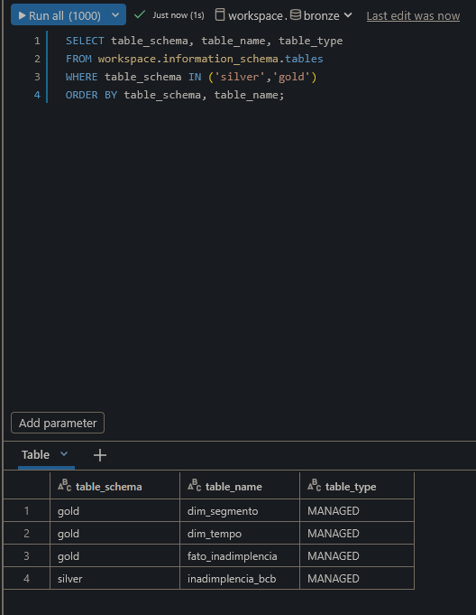
</p>

---

## Qualidade de Dados (Etapa 4.5)

**Scripts:** verificações em [`scripts/03_quality_checks.py`](scripts/03_quality_checks.py) · tratamentos em [`scripts/02_transform_silver.py`](scripts/02_transform_silver.py)

### Atributos no momento da captura (Bronze)

Os 6 CSVs chegam da API com o mesmo cabeçalho (`data;valor`), separador `;`, campos entre aspas e codificação UTF-8. Cada atributo bruto foi verificado antes de qualquer transformação:

| Atributo bruto | Como chega | Problema detectado | Como foi tratado no pipeline |
|---|---|---|---|
| `data` | texto `dd/mm/aaaa` (ex.: `"01/03/2011"`) | Data guardada como texto: não serve para ordenar, cruzar com `dim_tempo` nem calcular variação mensal. 0 vazios, 0 fora do padrão, 100% no dia 01 | Convertida para data/hora (`timestamp`) no `02` (`pd.to_datetime(format="%d/%m/%Y")`). Um valor inválido viraria nulo e seria contado no `03` (0 encontrados). Na Gold, dela deriva a chave `data_id` (AAAAMM) |
| `valor` | texto com vírgula decimal (ex.: `"3,17"`) | Número em formato brasileiro, como texto: não permite cálculo nem comparação. 0 vazios; 1110 de 1110 no padrão `n,nn` | Vírgula trocada por ponto e conversão para decimal no `02`, gerando `valor_pct` (double). Uma falha de conversão interromperia o pipeline, em vez de gerar um valor errado em silêncio |
| *(ausente)* segmento e modalidade | o arquivo não informa a qual recorte a série pertence | Depois de unir as 6 séries, elas ficariam indistinguíveis | `codigo_sgs`, `segmento` e `modalidade` adicionados no `02` a partir da lista de séries do script; na Gold, formam a `dim_segmento` |

### Verificação por dimensão (Silver)

| Dimensão | Resultado | Tratamento / decisão |
|---|---|---|
| ✅ **Completude** | 0 valores nulos em qualquer coluna. Nenhum mês faltando no meio de nenhuma série. | Nenhuma imputação necessária. |
| ✅ **Consistência** | 0 datas com falha de parsing; 100% das datas caem no dia 1 do mês; periodicidade mensal respeitada em todas as séries. | Datas padronizadas no `02` (texto → `timestamp`). |
| ✅ **Unicidade** | 0 linhas duplicadas (mesma série + mesma data). | Deduplicação preventiva por série e data no `02`, registrada no log da Silver (0 removidas). |
| ✅ **Acurácia** | Todos os valores dentro do domínio esperado [0%, 100%] (mínimo 0,36%, máximo 62,70%). | Nenhum valor descartado. |
| ⚠️ **Outliers** | Detectados via regra IQR por série: 26 no total, **não tratados como erro**: (1) meses de 2026 nas séries Total (5) e PF (4), que refletem uma alta real e recente; (2) a série de Crédito Rural (PF), com 13 outliers entre jul/2025 e jul/2026, que sai de 0,36%–0,61% em 2022 para 15,53% em jul/2026 — um evento econômico real, não um erro de captura; (3) PF em mai–jun/2012 (2) e PJ em abr–mai/2017 (2). Decisão documentada: manter os valores como estão. | Mantidos: removê-los apagaria justamente os eventos que P1 e P3 investigam. |
| ⚠️ **Atualidade** | Na primeira coleta, a série 21129 (cartão PF) terminava em 06/2026, um mês atrás das demais. Na nova coleta, o BCB já havia publicado 07/2026 e revisado 6 meses anteriores (jun/2026: 9,59% → 9,09%). | Nova ingestão pela API, com a data registrada em `bronze/_metadata_ingestao.json`; todas as séries passaram a terminar em 07/2026. |

---

## Análise de Dados (Etapa 4.5)

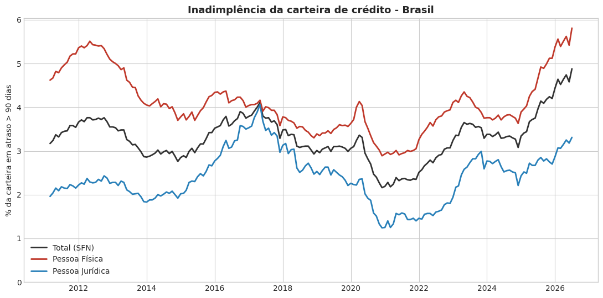

**P1 — Evolução da inadimplência total:** partiu de 3,17% em mar/2011, atingiu a mínima histórica de 2,16% em dez/2020 (efeito das renegociações e liquidez do período de pandemia) e fechou jul/2026 em **4,88% — o valor mais alto de toda a série histórica**, acima do pico de 2017 (4,11%), que já havia sido superado em ago/2025 (4,14%).

**Discussão:** não se trata de uma volta a um patamar já visto. Desde ago/2025 a série renovou o recorde histórico 7 vezes (de 4,14% a 4,88%). Para o problema, isso indica que o ciclo atual de inadimplência já é o mais severo dos 15 anos observados.

**P2 — Pessoa física vs. jurídica:** PF esteve **acima de PJ em 100% dos 185 meses** analisados. Em jul/2026, PF está em 5,81% contra 3,31% de PJ (razão de 1,76x). A média histórica é 4,09% (PF) vs. 2,41% (PJ).

**Discussão:** a diferença é estrutural, não passageira. PJ nunca superou PF, embora a distância tenha variado muito: de 2,43x em dez/2011 a quase empate (1,02x) em mai/2017, quando a inadimplência PJ atingiu seu pico. Desde a mínima de dez/2020, os dois segmentos subiram (PF +2,92 p.p.; PJ +2,07 p.p.), mas só PF está hoje no maior nível da série: PJ (3,31%) segue abaixo do pico de 2017 (4,06%). Ou seja, a alta atual é puxada principalmente pelas pessoas físicas.

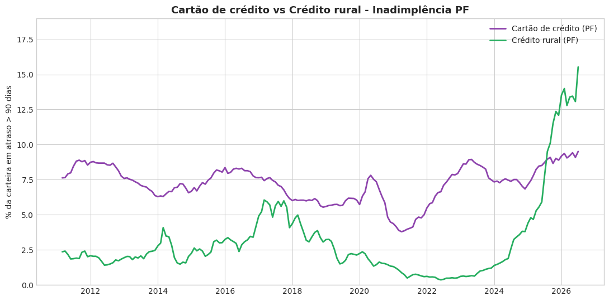

> [!IMPORTANT]
> **P3 — Cartão de crédito vs. crédito rural (PF):** durante quase toda a série (até meados de 2025), o cartão de crédito foi consistentemente a modalidade mais crítica (média histórica de 7,20% vs. 3,09% do rural). Isso **se inverteu recentemente**: o crédito rural saiu de 1,88% em jun/2024 para 15,53% em jul/2026 (+13,65 p.p. em 25 meses) e **ultrapassou o cartão de crédito** (9,51% em jul/2026) — o achado mais forte desta análise, provavelmente ligado a estresse no agronegócio nesse período.
>
> **Discussão:** o cartão de crédito PF também está no maior nível da série (9,51% em jul/2026). Ou seja, o cartão não melhorou: o crédito rural é que piorou muito mais rápido, multiplicando sua inadimplência por mais de 8 em 25 meses. Hipóteses para essa alta, não testadas neste MVP: juros elevados, queda nos preços das commodities, custos de produção altos, eventos climáticos adversos e endividamento acumulado em 2020–2023.

**P4 — Sazonalidade:** fraca. A média mensal da série Total varia pouco ao longo do ano (mínima em dezembro, 3,15%; máxima em maio, 3,44%) — uma amplitude de apenas 0,29 p.p., não caracterizando um padrão sazonal forte.

**Discussão:** para o problema, isso significa que a evolução vista em P1 não é efeito de calendário: as variações relevantes vêm de tendências e ciclos econômicos de vários anos, não do mês do ano. Ressalva de método: as médias por mês foram calculadas sem remover a tendência de longo prazo (ver Limitações na Autoavaliação).

**P5 — Maior alta/queda mensal:** a maior alta mensal individual foi em jul/2026 (+0,30 p.p., o mês mais recente da série). A maior queda mensal foi em jun/2020 (-0,36 p.p.), coincidindo com os programas de renegociação de crédito durante a pandemia.

**Discussão:** os extremos confirmam a leitura de P1. As 5 maiores altas mensais de toda a série ocorreram entre jan/2025 e jul/2026, enquanto as maiores quedas se concentram entre 2017 e 2020 (mais dez/2023). A aceleração é recente e, até o último mês disponível, não mostra reversão.

<p align="center">
  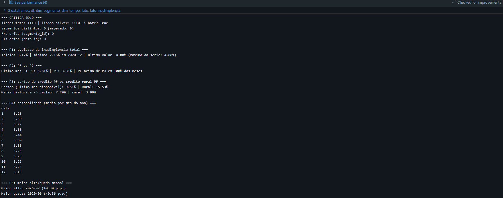
</p>

### Discussão geral

Voltando ao problema — entender como a inadimplência de crédito evoluiu e como se comporta entre PF, PJ e modalidades —, as cinco respostas contam uma história coerente:

1. **Evolução:** a inadimplência total está no maior nível em 15 anos, depois de 7 recordes desde ago/2025 (P1), e as maiores altas mensais da série aconteceram justamente agora (P5).
2. **Quem puxa a alta:** as pessoas físicas. PF sempre esteve acima de PJ (P2) e é o único dos dois segmentos em máxima histórica; PJ ainda está abaixo do pico de 2017.
3. **Onde, dentro de PF:** nas duas modalidades analisadas, ambas em máxima histórica em jul/2026 — com destaque para o crédito rural, que ultrapassou o cartão de crédito (P3).
4. **O que não explica a alta:** o calendário. A sazonalidade é desprezível (P4), então o movimento não é efeito de época do ano.

Em conjunto: entre 2025 e 2026, o Brasil vive o ciclo de inadimplência mais severo da série, concentrado nas pessoas físicas e com um foco novo e inesperado no crédito rural. As causas ficam como hipóteses: testá-las exige cruzar estas séries com juros (Selic), preços de commodities e dados de recuperação judicial, como proposto em Trabalhos futuros.

---

## Autoavaliação

O objetivo traçado no início — entender como a inadimplência de crédito no Brasil evoluiu ao longo do tempo, comparando pessoas físicas e jurídicas e diferentes modalidades — foi atingido. Das cinco perguntas formuladas na etapa inicial, todas foram respondidas — inclusive a P4, sobre sazonalidade, que veio praticamente negativa: a amplitude entre os meses foi de apenas 0,29 p.p., o que não caracteriza um padrão sazonal relevante. Mantive a pergunta no documento mesmo assim, porque um resultado negativo continua sendo uma resposta.

A que mais me marcou foi a P3: eu a escrevi partindo do pressuposto de que o cartão de crédito seria a modalidade com maior inadimplência, e os dados mais recentes mostraram o contrário — o crédito rural PF saiu de 1,88% em jun/2024 para 15,53% em jul/2026, ultrapassando o cartão. A primeira impressão foi de que poderia se tratar de alguma anomalia nos dados, mas não era: a alta foi gradual ao longo de 25 meses, os testes de completude, consistência e unicidade não encontraram problemas na série e os valores conferem com a API do BCB. A principal hipótese que levanto para esse efeito abrupto é que a elevação da inadimplência do crédito rural para pessoas físicas a partir de 2024 decorra da combinação entre a forte alta dos juros, a queda nos preços das commodities, a persistência de custos de produção elevados, os impactos de eventos climáticos adversos e o excessivo endividamento acumulado durante o ciclo de bonança de 2020-2023 — uma hipótese que os dados deste MVP não permitem confirmar.

Percebi, depois, que a série 21146 é classificada como "pessoa física", mas o devedor ali é o produtor rural — não uma família consumindo no cartão. O recorte PF do BCB agrega perfis econômicos bem diferentes, e isso só ficou claro para mim depois de ver os dados.

### Dificuldades encontradas

A parte mais desafiadora da criação do pipeline foi descobrir onde o Databricks permite escrita (Volume, workspace file, disco local). Precisei pesquisar como a plataforma se comporta, e cheguei a rodar a extração gravando os arquivos num caminho diferente do que a etapa Silver lia: o pipeline executou sem erro, mas com os dados antigos, e só percebi porque o log da Silver continuava mostrando 184 linhas para a série 21129.

Essa mesma série trouxe outra dificuldade. Na primeira coleta, ela estava um mês defasada em relação às demais, e precisei decidir se era erro de coleta ou comportamento normal da fonte. Ao coletar de novo, o BCB já tinha publicado jul/2026 e revisado meses anteriores (o cartão de crédito PF de jun/2026 passou de 9,59% para 9,09%). Isso me mostrou que dados públicos podem mudar depois de publicados, e que o resultado da análise vale para a data da coleta.

Também precisei decidir não tratar os outliers do crédito rural: eles eram anômalos estatisticamente, mas reais economicamente. Pesquisei o contexto econômico para entender esse aumento repentino, mas a causa não pode ser confirmada com os dados deste MVP. Reforço que essa não era a ideia central — eu pretendia analisar a carteira de cartão de crédito PF, e não a de crédito rural.

### Limitações

As transformações foram feitas em pandas, e o Spark foi usado apenas para ler e gravar as tabelas; com 1110 linhas isso funciona, mas não aproveita o processamento distribuído da plataforma. Na P4, calculei a média por mês do ano sem remover a tendência de longo prazo, o que é uma forma simples de olhar sazonalidade.

### Trabalhos futuros

O pipeline mostra que o crédito rural disparou, mas não por quê. Cruzar essas séries com Selic, preços de commodities ou dados de recuperação judicial permitiria testar as hipóteses que levantei aqui, em vez de apenas sugeri-las.

---

<div align="center">
<sub>MVP da Sprint de Engenharia de Dados · Pós-graduação PUC-Rio · Dados: Banco Central do Brasil (SGS), licença ODbL</sub>
</div>
